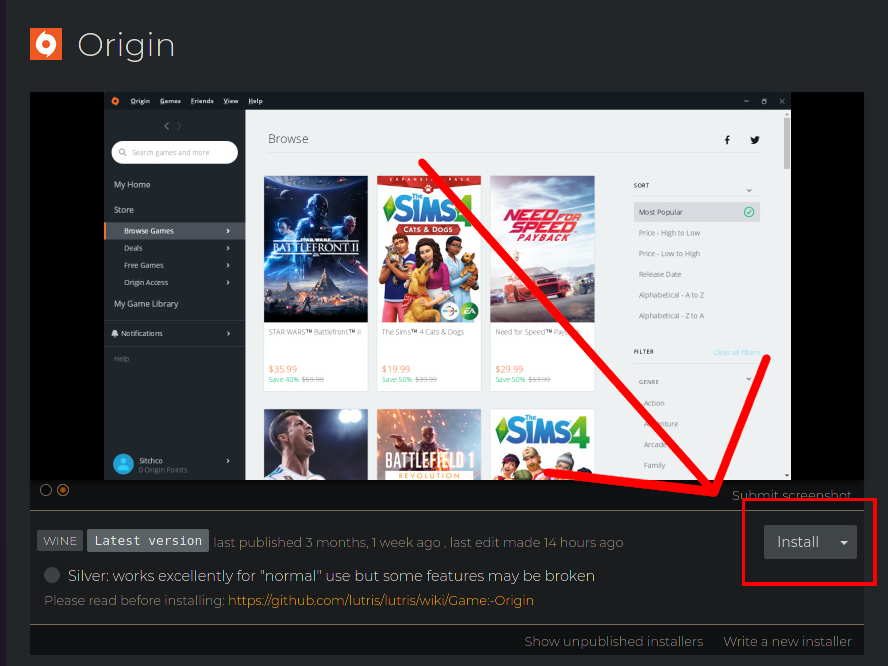
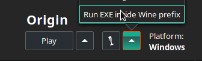
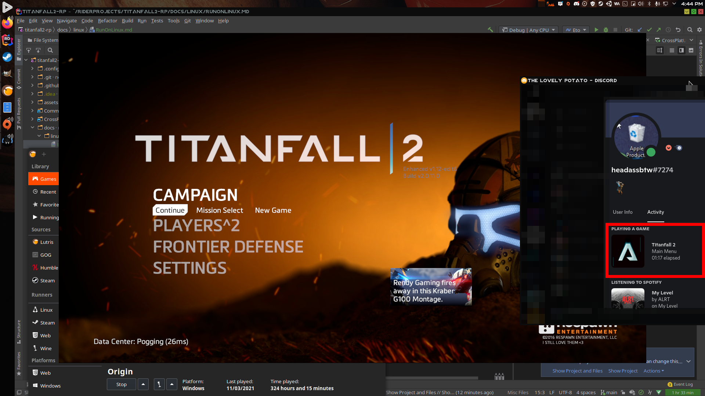

# Running on Linux

This document will go over how to run this application on Linux.

Currently, I'm only aware of a method to run this under Lutris, so that's what I'll go over here.
  
It should be possible to run this under steam, but I personally haven't gotten it to work.
## While Lutris isn't strictly required, it's recommended.
* Head over to [the Lutris download page](https://lutris.net/downloads/) and follow the instructions for your distro.
* Go to the [Origin page on Lutris](https://lutris.net/games/origin) and run the installer.

*The highlighted button should automatically open Lutris, and prompt you to install Origin, if you have Lutris installed.*

* Install Titanfall 2 through Origin, just as you would on Windows.
* Download the [Wine Discord IPC bridge](https://github.com/0e4ef622/wine-discord-ipc-bridge/releases/tag/v0.0.1), and put it somewhere that you'll remember (you'll be running it every time you want the rich presence program to work).
* Download the rich presence app [from here](https://github.com/IncPlusPlus/titanfall2-rp/releases/latest/download/titanfall2-rp-Wine.exe), and put it somewhere you'll remember.
* Launch the IPC bridge in the same wine prefix as Origin.

* Launch Origin.
* Launch Titanfall 2.

* Launch the rich presence app in the same way you launched the IPC bridge.
* Enjoy!

